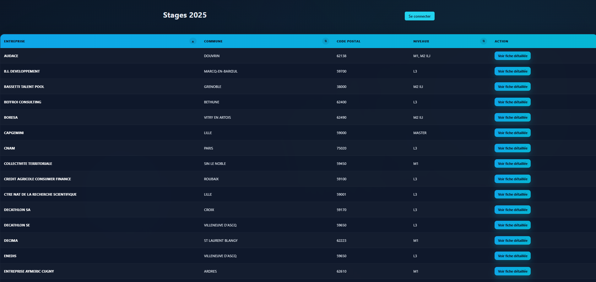

# Mon Futur Stage

A Jakarta MVC application for managing internship data, running on Docker with PostgreSQL.

## Apercu

### Liste des stages



## Quick Start

```bash
# Prerequisite: Docker installed
docker-compose up -d
```

Access: **http://localhost:8080/mon-futur-stage/mvc/**

## Preconfigured Users

| Type | Username | Password | Role |
|------|----------|----------|------|
| Student | mail1@ens.univ-artois.fr | password | STUDENT |
| Student | etudiant | password | STUDENT |
| Admin | Daniel | admin123 | ADMIN |
| Admin | johan | admin123 | ADMIN |
| Admin | admin | admin | ADMIN |

> **Note**: For ADMIN users, the username must match the teacher's first name in the CSV for the import feature to work.

## Docker Commands

```bash
docker-compose logs -f app    # View logs
docker-compose down           # Stop
docker-compose up -d --build  # Rebuild after modifications
```

## Technology Stack

- **Framework**: Jakarta EE 10 (MVC 2.1, JAX-RS 3.1, CDI 4.0)
- **Server**: Apache Tomcat 10.1+
- **Database**: PostgreSQL 15
- **Build**: Apache Maven 3.8+

## Project Structure

```text
|-- docker-compose.yml    # Docker orchestration
|-- Dockerfile            # Multi-stage build (Maven + Tomcat)
|-- docker/
|   `-- tomcat-users.xml  # Preconfigured users
|-- src/
|   |-- main/java/        # Controllers, Services, Models
|   |-- main/webapp/      # JSP views, web.xml
|   `-- main/resources/   # Configuration files
`-- stages2025-anonyme.csv # Internship data
```
